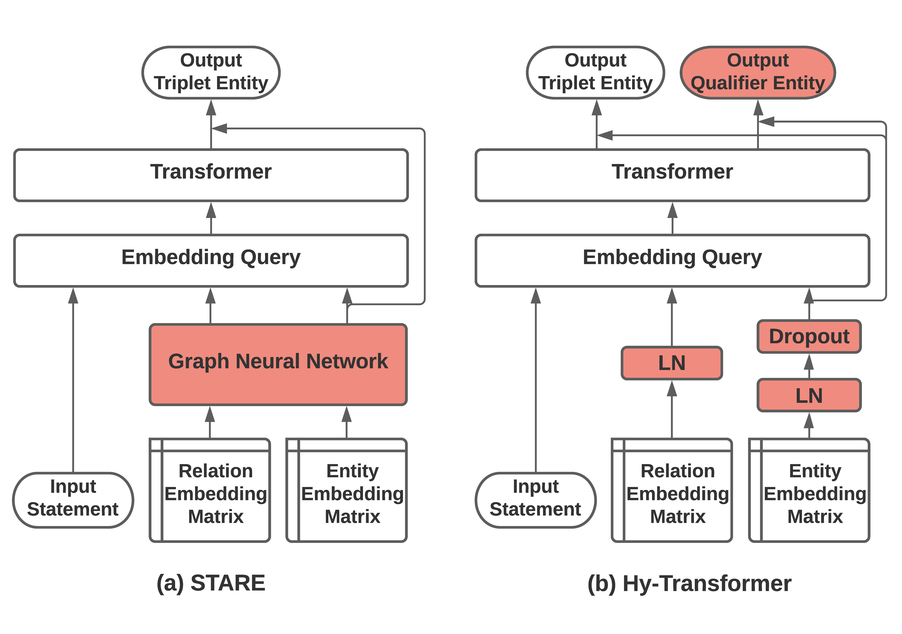

# Hy-Transformer

This repository is the official implementation of [Improving Hyper-Relational Knowledge Graph Completion](https://arxiv.org/abs/2104.08167) in AAAI 2022 *Deep Learning on Graphs* Workshop. The majority of this code base is from https://github.com/migalkin/StarE. We thank the authors for their contribution.



## Requirements
* Python 3.7
* PyTorch 1.5.1
* torch-geometric 1.6.1
* torch-scatter 2.0.5
* tqdm
* wandb

Create a new conda environment and execute `setup.sh`.
Alternatively
```
pip install -r requirements.txt
```

## Running the experiments

Running on WD50K dataset:
```
./run_batch_wd50k.sh ${GPU-ID} wd50k statements StarE hy-transformer_mask True
```


Running on JF17K dataset:
```
./run_batch_jf17k.sh ${GPU-ID} jf17k statements StarE hy-transformer_mask True 
```

Running on WikiPeople dataset:
```
./run_batch_wikipeople.sh ${GPU-ID} wikipeople statements StarE hy-transformer_mask True
```

For any further questions, please contact:  ```dyu2@cs.cmu.edu```
